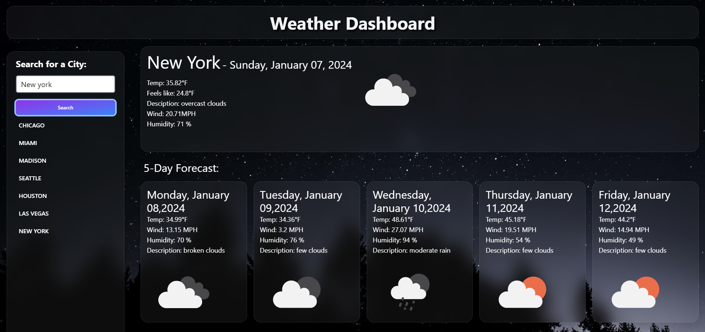

# Work Day Scheduler
   

## Description  :bookmark_tabs:

This project was a bit challenging for me because I have always struggled with "Fetch API" and was very confusing for me but I finally understood it after long hours of studying. The fact that I was gonna create a Weather App was so fascinating for me so I did put a lot of hours to really understand all the tools that I needed to make this project great.  The functionality of the application is to show you the weather of an specific city plus the forecast of the next 5 days, in addition to that you can go back and check the cities that you have already searched without typing them over again. In brief, I learned how to use fetch on my porjects and how to extract the data from the API's.

## Installation :computer:

You are able to use the work day scheduler and see my code ahead:

 1. If you want to try the actual application, you can go to this URL: https://stroyer210.github.io/Weather-App/
 2. If you want to see my code, you have my repository's folder on top, plus all the documents, such HTML, CSS and JavaScript.

## Usage :bar_chart:
If you are unable to open the URL, I attached a screenshot of it below:
    ---
    
    ---
    
After you open the application, you can search the city that you would like to check the weather and it will show you the actual temperature, desciption, wind, humidity, etc., of that city, plus the forecast of the next 5 days. You can also go back and check the previous cities by clicking the search history cities. 

## Credits :email:

List of all the links that made me succeed this project:
- https://stroyer210.github.io/Weather-App/ 
- https://blog.bitsrc.io/day-js-future-of-javascript-day-and-time-handling-372b187c99d8
- https://day.js.org/docs/en/display/format
- https://itnext.io/that-data-looks-so-fetching-on-you-understanding-the-js-fetch-api-880eae0c8d25#:~:text=So%20for%20every%20fetch(),actually%20work%20with%20the%20data.
- https://www.youtube.com/watch?v=QEu8_5bYm-w
- https://flowbite.com/docs/typography/text/#font-size
- https://web.postman.co/workspace/My-Workspace~fbd80586-415d-46c1-8e36-9bd1039aa279/request/create?requestId=6acfabd9-3971-44eb-81c3-5ef1e9abcc5d
- https://openweathermap.org/weather-conditions
- https://openweathermap.org/forecast5
- https://developer.mozilla.org/en-US/docs/Web/API/Element/classList
- https://stackoverflow.com/questions/4689344/how-can-i-add-href-attribute-to-a-link-dynamically-using-javascript

## License :memo:
---
---
MIT License

Copyright (c) 2023 Sergio S. Ardila-Alvarado

Permission is hereby granted, free of charge, to any person obtaining a copy
of this software and associated documentation files (the "Software"), to deal
in the Software without restriction, including without limitation the rights
to use, copy, modify, merge, publish, distribute, sublicense, and/or sell
copies of the Software, and to permit persons to whom the Software is
furnished to do so, subject to the following conditions:

The above copyright notice and this permission notice shall be included in all
copies or substantial portions of the Software.

THE SOFTWARE IS PROVIDED "AS IS", WITHOUT WARRANTY OF ANY KIND, EXPRESS OR
IMPLIED, INCLUDING BUT NOT LIMITED TO THE WARRANTIES OF MERCHANTABILITY,
FITNESS FOR A PARTICULAR PURPOSE AND NONINFRINGEMENT. IN NO EVENT SHALL THE
AUTHORS OR COPYRIGHT HOLDERS BE LIABLE FOR ANY CLAIM, DAMAGES OR OTHER
LIABILITY, WHETHER IN AN ACTION OF CONTRACT, TORT OR OTHERWISE, ARISING FROM,
OUT OF OR IN CONNECTION WITH THE SOFTWARE OR THE USE OR OTHER DEALINGS IN THE
SOFTWARE.

---
---

